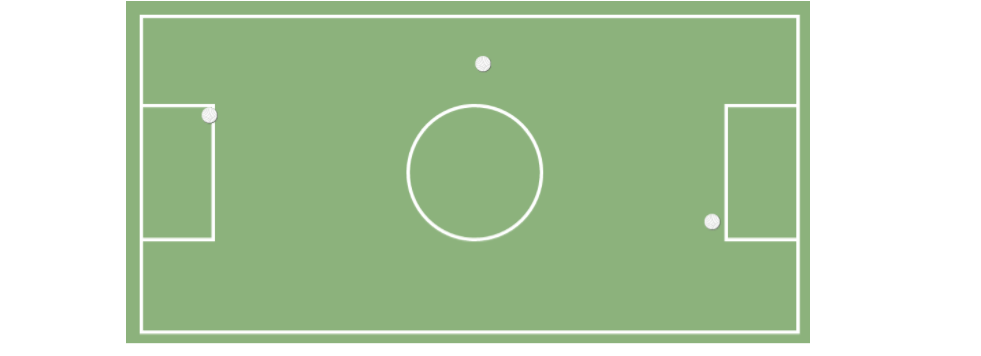
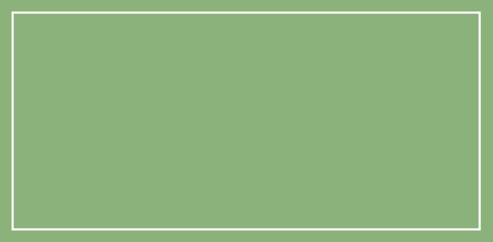

### Proyecto: "La cancha de Fútbol" ###

--------------------------------------------------------------

1) __Objetivo__

  Para este proyecto nos indican que debemos replicar la siguiente imagen, utilizando positioning.
  

2) __desarrrollo__

  2.1 ***Primera Parte***

  Para empezar realizamos nuestra estructura html en la que le puese color verde luego ingresé una tabla luego seguí con los estilos:el borde blanco,altura,anchura y grosor del borde,y me quedó así:

  2.2 ***Segunda Parte***

  Para esta parte inserté iconos : square y ball
